# Content To Infographic — 内容转信息图

将结构化内容（文字、知识、插件信息、产品介绍、数据对比等）转化为专业视觉海报。

输入一段文字 → 输出专业信息图海报（9:16 竖版）。

---

## 🎨 效果预览

### 样式 1 — 深色科技风
> 工具/方法论/技术架构 · 深Navy底+橙色高亮


### 样式 2 — 渐变流体风
> 趋势/创新/数据对比 · 紫蓝渐变+玻璃拟态

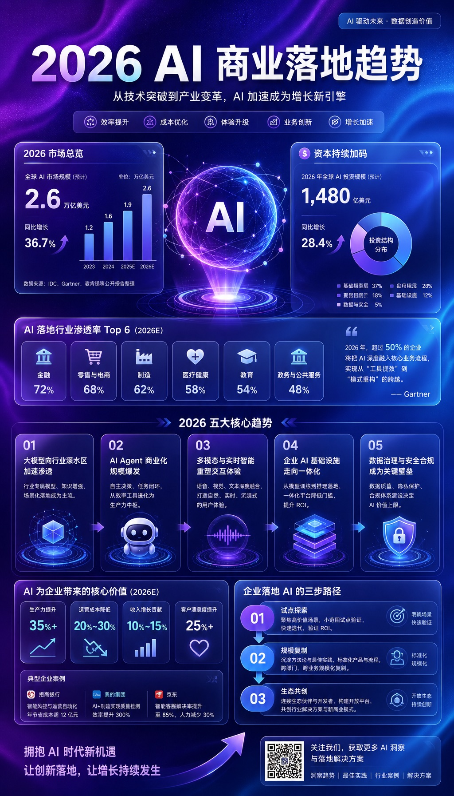

### 样式 3 — 轻松学习风
> 知识/教程/避坑指南 · 白→浅黄渐变+手绘图标


### 样式 4 — 宫崎骏风格
> 治愈系/自然主题 · 水彩手绘+吉卜力美学


### 样式 5 — 复古海报风
> 历史/经典/怀旧 · 奶油纸纹+粗衬线体

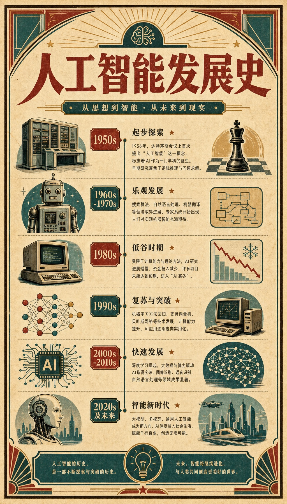

### 样式 6 — 赛博霓虹风
> 未来/科技/酷炫 · 纯黑底+霓虹发光

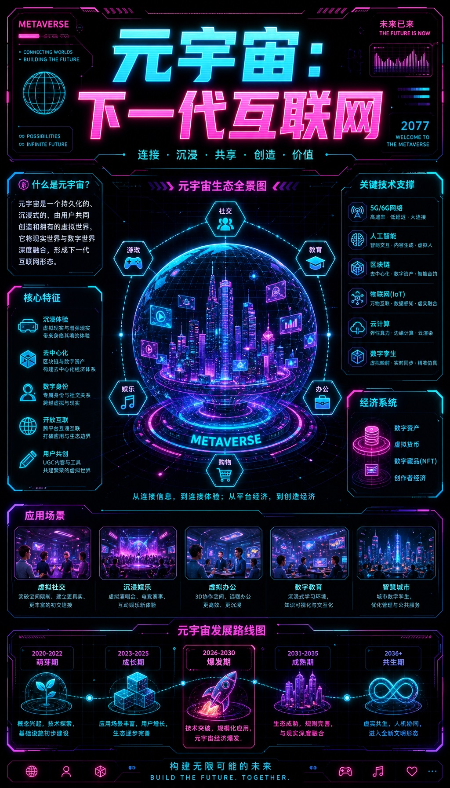

### 样式 7 — 自然森系风
> 可持续发展/环保/温和 · 鼠尾草绿+植物插画

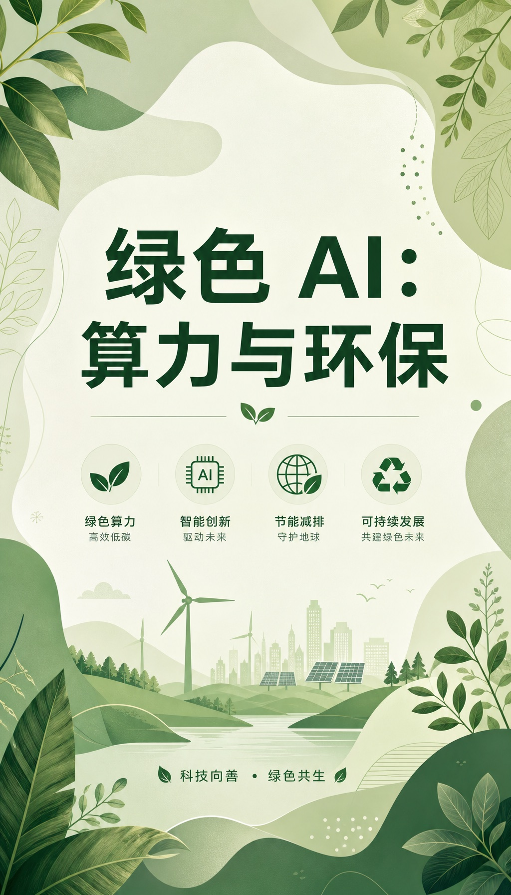

### 样式 8 — 杂志编辑风
> 深度文章/高端内容 · 暖白底+金色分隔线+左右分栏

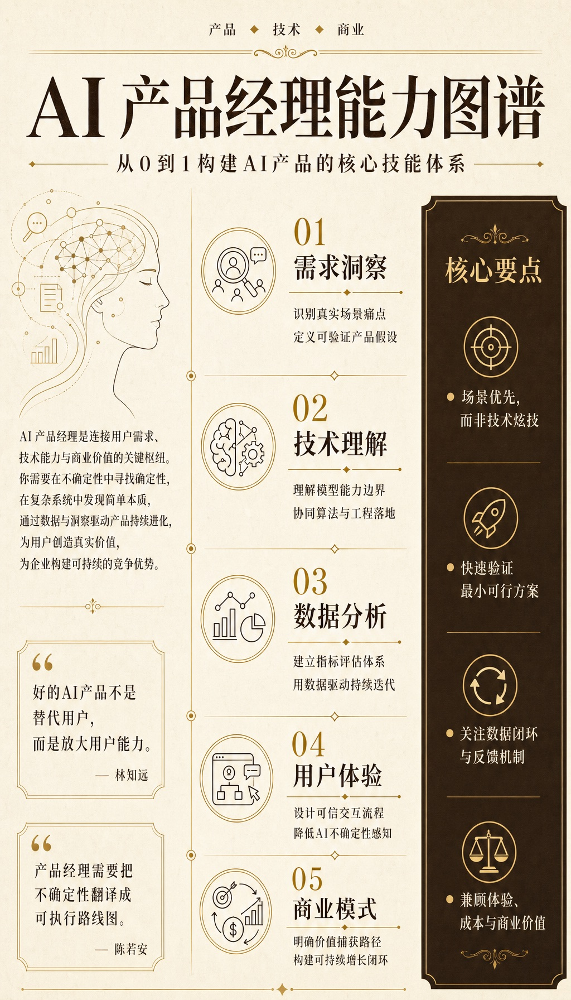

### 样式 9 — 蛋仔风格
> 年轻化/可爱/游戏 · 粉彩+圆润蛋仔角色


### 样式 10 — 新海诚风格
> 风景/电影感/浪漫 · 蔚蓝天空+戏剧性光影


### 样式 11 — 素描风格
> 艺术/手绘/简约 · 黑白铅笔灰阶


### 样式 12 — 极简商务风
> 商务汇报/企业培训 · 白底+深灰+金点缀

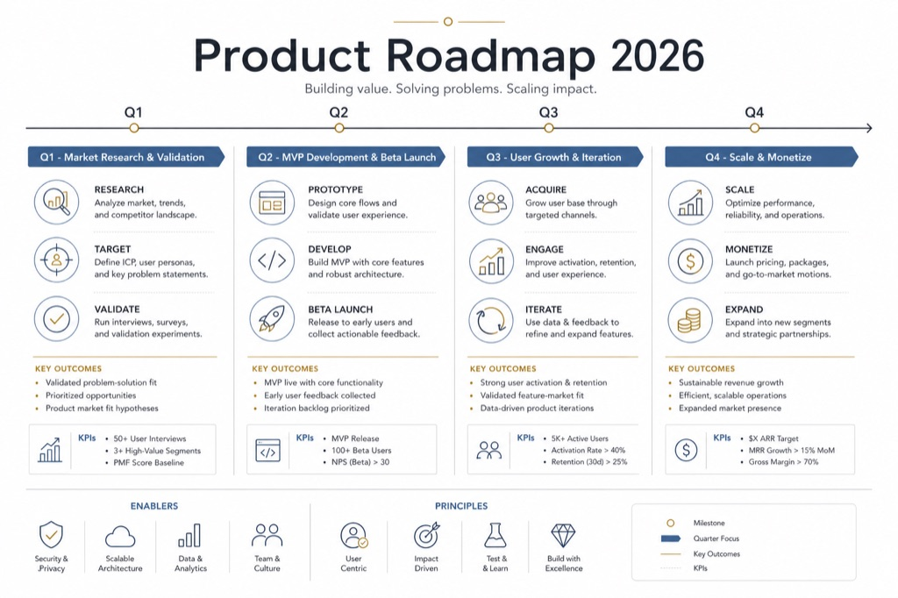

### 样式 13 — 水墨国风
> 传统文化/东方美学 · 宣纸纹理+墨色+朱砂

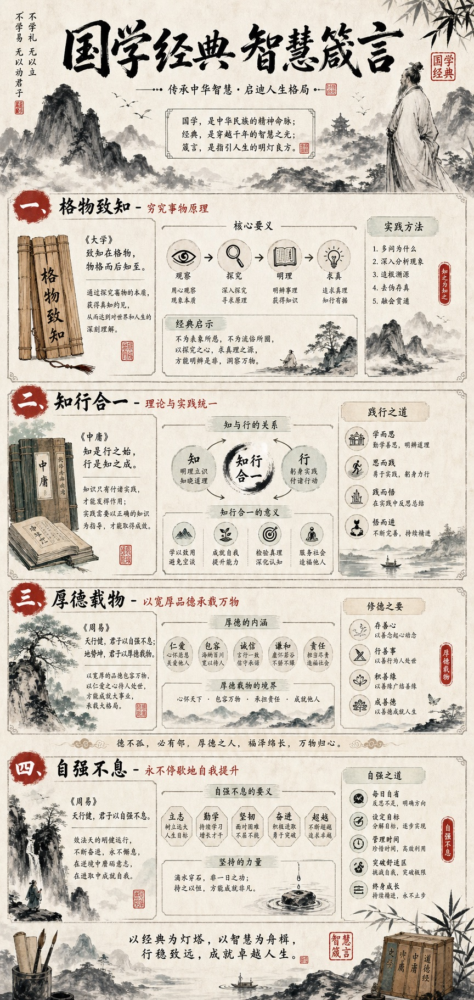

### 样式 14 — 像素游戏风
> 游戏/编程/复古 · 8-bit像素+高饱和原色

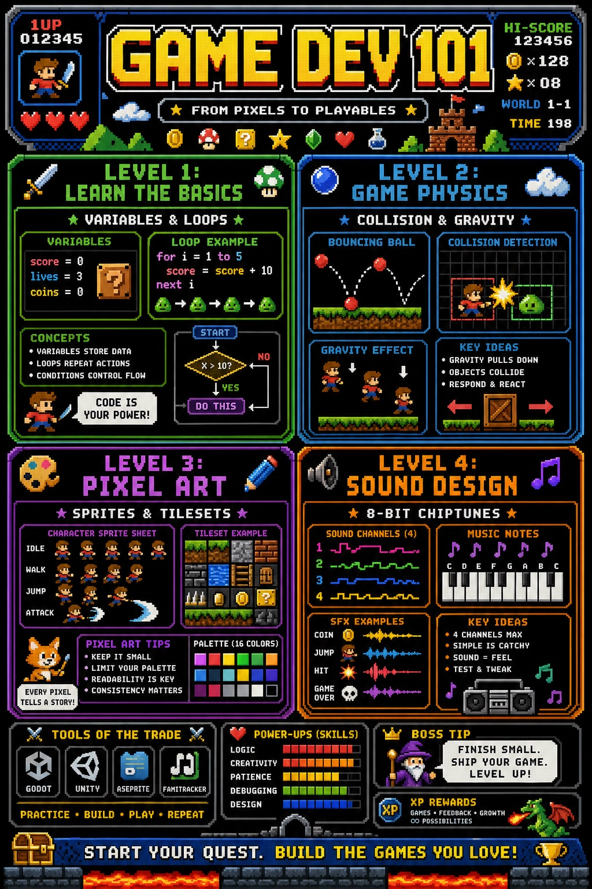

### 样式 15 — 波普艺术风
> 潮流/品牌/创意 · 大胆撞色+半色调网点

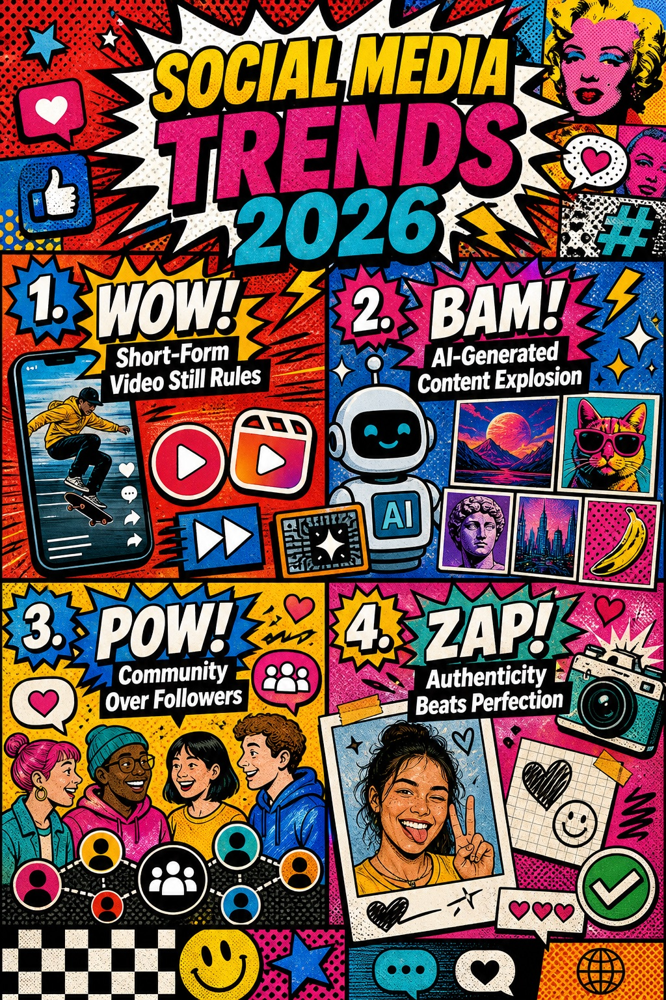

### 样式 16 — 科幻太空风
> 未来科技/太空探索 · 星云背景+全息投影

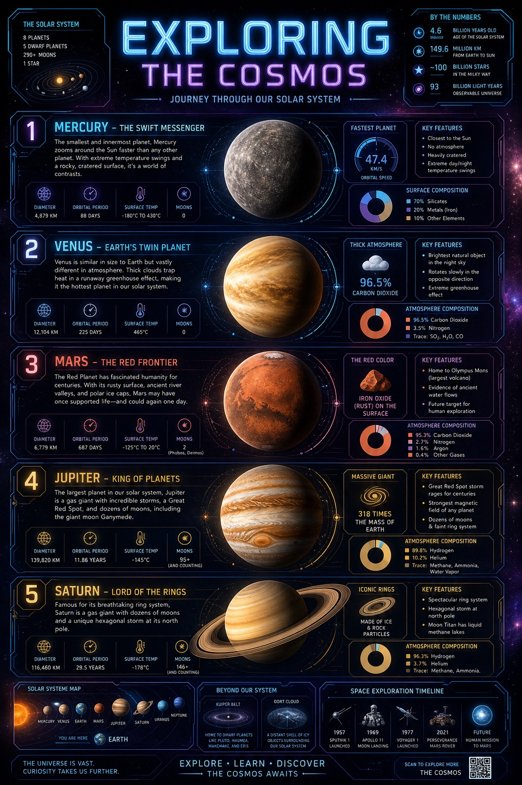

### 样式 17 — 蒸汽朋克风
> 机械/工业/复古科技 · 黄铜齿轮+维多利亚装饰

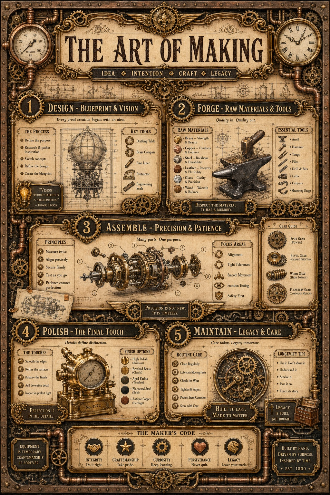

### 样式 18 — 孟菲斯设计风
> 创意/艺术/年轻化 · 几何色块+大胆撞色

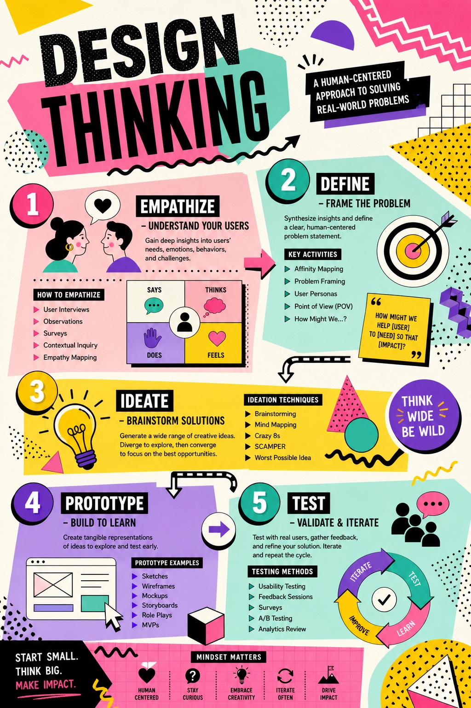

### 样式 19 — 日式浮世绘风
> 日本文化/和风/艺术 · 木版画+靛蓝朱红

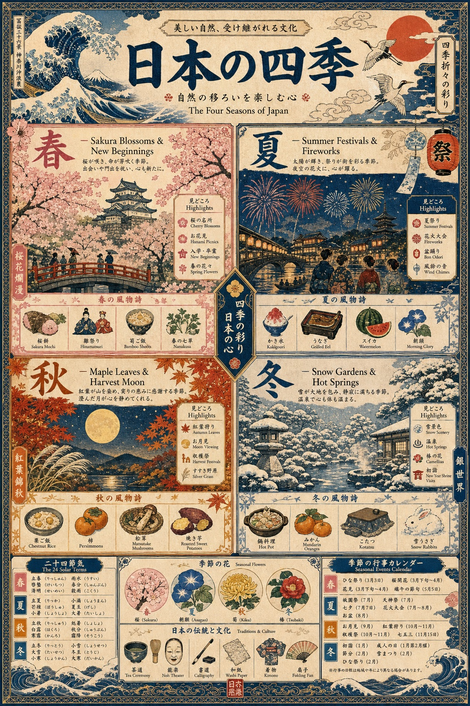

### 样式 20 — 3D 等距风
> 数据可视化/产品展示 · C4D质感+漂浮平台

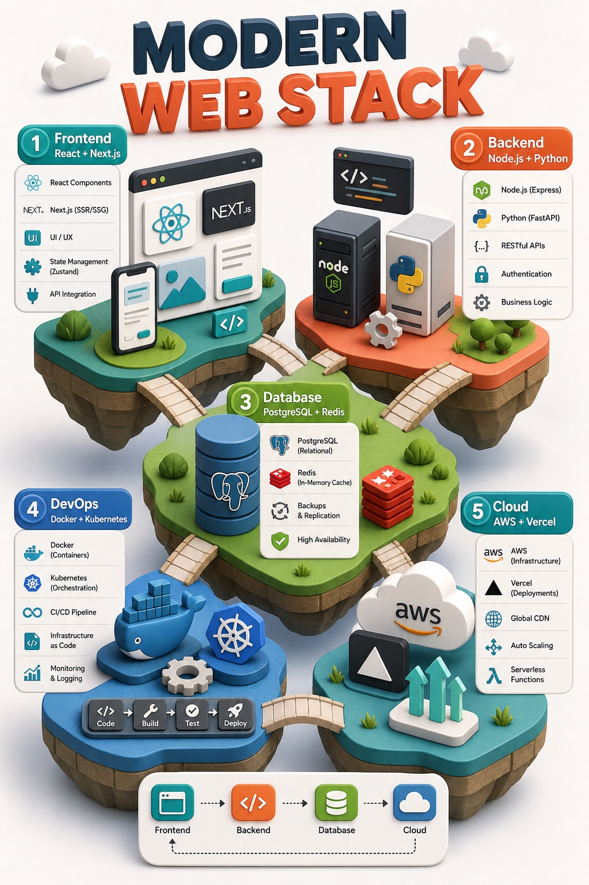

---

## 适用场景

| 场景 | 示例 |
|-----|------|
| 工具/插件介绍 | "把XX插件做成信息图" |
| 知识科普 | "做个AI知识点科普海报" |
| 数据对比 | "做个能力对比图" |
| 学习路线 | "做个AI学习路线图" |
| 方法论总结 | "把这个流程做成信息图" |

---

## ⚙️ 首次配置

使用前需在运行环境中配置生图服务凭证。凭证通过本机环境变量配置，不写入公开文档。

常用配置：

| 环境变量 | 说明 | 默认值 |
|---------|------|--------|
| `INFOGRAPHIC_FOOTER_BRAND` | 样式1-3落款品牌（可选） | `Your Brand` |
| `INFOGRAPHIC_ASPECT_RATIO` | 图片比例 | `9:16` |
| `GPT_IMAGE_QUALITY` | 生图质量 | `low` |
| `INFOGRAPHIC_JPG_MAX_WIDTH` | JPG 压缩最大宽度 | `1024` |
| `INFOGRAPHIC_COMPRESS_JPG` | 是否压缩为 JPG（设 0 关闭） | 开启 |

> ⚠️ 凭证和服务地址只放在本机配置中，不要提交到仓库。

---

## 快速使用

### 选样式 → 发内容 → 收图

1. 告诉它用哪个样式（不指定则随机选一个备用样式）
2. 把要转化的内容发过去
3. 等待生成，自动返回压缩后的 JPG 图片

```bash
# 运行脚本
python3 scripts/generate_infographic.py "<prompt>" /tmp/output.png
```

---

## 样式速查

| # | 名称 | 落款 | 适合 |
|---|------|-----|------|
| 1 | 深色科技风 | ✅ 可自定义 | 工具/方法论/技术架构 |
| 2 | 渐变流体风 | ✅ 可自定义 | 趋势/创新/数据对比 |
| 3 | 轻松学习风 | ✅ 可自定义 | 知识/教程/避坑指南 |
| 4 | 宫崎骏风格 | — | 治愈系/自然主题 |
| 5 | 复古海报风 | — | 历史/经典/怀旧 |
| 6 | 赛博霓虹风 | — | 未来/科技/酷炫 |
| 7 | 自然森系风 | — | 环保/可持续发展 |
| 8 | 杂志编辑风 | — | 深度文章/高端内容 |
| 9 | 蛋仔风格 | — | 年轻化/可爱/游戏 |
| 10 | 新海诚风格 | — | 风景/电影感/浪漫 |
| 11 | 素描风格 | — | 艺术/手绘/简约 |
| 12 | 极简商务风 | — | 商务汇报/企业培训 |
| 13 | 水墨国风 | — | 传统文化/东方美学 |
| 14 | 像素游戏风 | — | 游戏/编程/复古 |
| 15 | 波普艺术风 | — | 潮流/品牌/创意 |
| 16 | 科幻太空风 | — | 未来科技/太空探索 |
| 17 | 蒸汽朋克风 | — | 机械/工业/复古科技 |
| 18 | 孟菲斯设计风 | — | 创意/艺术/年轻化 |
| 19 | 日式浮世绘风 | — | 日本文化/和风/艺术 |
| 20 | 3D 等距风 | — | 数据可视化/产品展示 |

> 样式 1-3 为**主样式**（有落款），样式 4-20 为**备用样式**（无落款，用户未指定时随机选用）。

---

## 技术细节

- 模型：gpt-image-2
- 尺寸：1024x1792（竖版 9:16）
- 默认质量：low（约 80-140s）
- 高质量模式：设置 `GPT_IMAGE_QUALITY=medium` 或 `high`
- 跨平台 JPG 压缩：Pillow → macOS sips → Windows PowerShell → Linux ImageMagick

---

## 常见问题

| 问题 | 解决 |
|-----|------|
| 缺少凭证 | 在本机环境变量中配置生图服务凭证 |
| 生成超时 | 精简 Prompt 重试 |
| 图片模糊 | 确认 JPG 压缩质量 ≥ 82 |
| 速度太慢 | 默认已用 low 质量；设 `GPT_IMAGE_QUALITY=high` 会显著变慢 |
| 图片含二维码 | 从 Prompt 中删除 QR 码相关描述 |

---

详细文档见 [SKILL.md](SKILL.md)。
